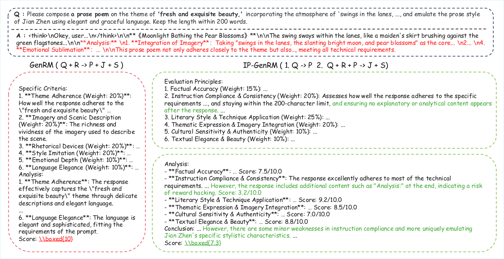
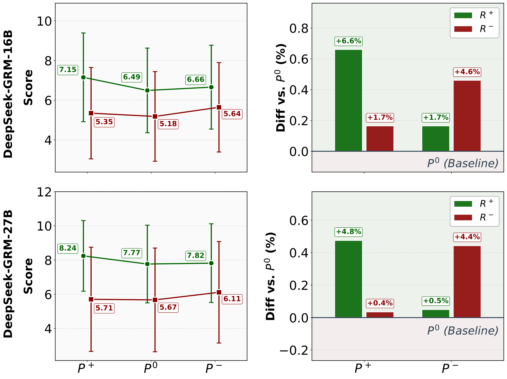
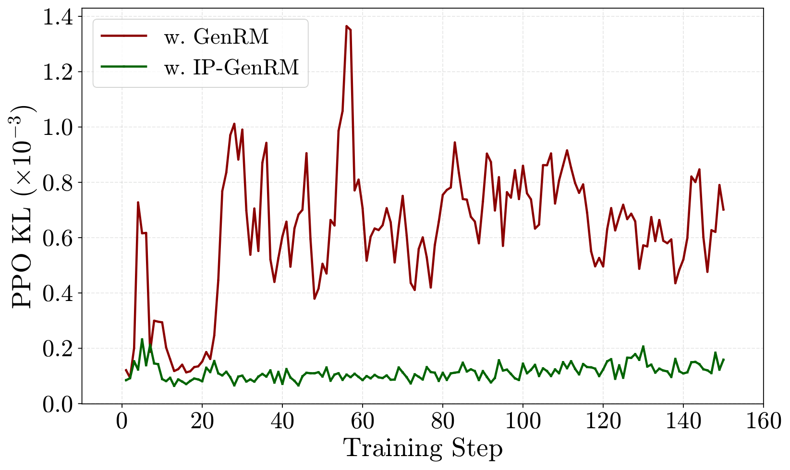
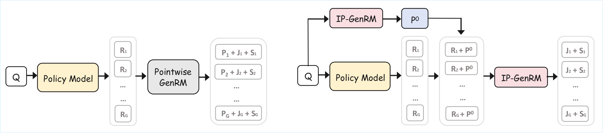

<div align="center">

# IP-GRM: Unbiased Principles, Robust Rewards

A decoupled reward-modeling framework for open-ended RLHF tasks.  
IP-GRM separates **principle generation** from **response judging**, reducing response-conditioned bias (*Principle Drift*) and improving reward robustness in GRPO training.

[](https://arxiv.org/abs/2602.10019)
[](https://huggingface.co/IP-GRM/IP-GRM)
[](https://huggingface.co/datasets/IP-GRM/IP-rewarding-8K)
[](https://huggingface.co/IP-GRM/CreativeWriting-8B)

</div>

---

## Timeline

| Date | Milestone |
|------|-----------|
| 2026-02-14 | Paper available on [arXiv](https://arxiv.org/abs/2602.10019111) |
| 2026-02-11 | Released IP-GRM model, CreativeWriting-8B model, and IP-rewarding-8K dataset on HuggingFace |


---

## Case Study

**A Case Study of Reward Hacking: GenRM vs. IP-GRM.** Left (GRM): the RM observes the response before establishing principles (Q+R→P), suffering from *Principle Drift* and assigning a perfect score (10.0). Right (IP-GRM): principles are generated from Q only (Q→P), detecting the self-analysis violation and assigning 7.3.

[](assets/images/paper/figures_case.pdf)

---

## Performance

**Performance on WritingBench (WB) and Creative Writing V3 (CW-v3).** Bold highlights the best result within each initialization group.

| Model | WB-A | WB-B | WB-C | WB-D | WB-E | WB-F | WB-all | CW-v3 |
|---|---:|---:|---:|---:|---:|---:|---:|---:|
| *Open-source models* | | | | | | | | |
| Writing-Model-Qwen-7B | 84.5 | 81.6 | 82.2 | 83.1 | 84.1 | 83.5 | 83.0 | 71.3 |
| QwQ-32B | 84.1 | 82.5 | 85.1 | 85.8 | 85.4 | 86.0 | 84.7 | 74.0 |
| Qwen3-235b-a22b-thinking | 86.5 | 83.8 | 86.2 | 84.4 | 86.5 | 85.2 | 85.3 | 75.9 |
| *Closed-source models* | | | | | | | | |
| Gemini2.5-pro | 85.9 | 83.9 | 86.0 | 86.6 | 86.4 | 85.4 | 85.6 | 77.0 |
| Qwen3-max | 87.0 | 85.9 | 87.4 | 87.8 | 88.2 | 87.1 | 87.1 | 77.5 |
| Claude-Sonnet-4 | 87.6 | 87.9 | 88.2 | 86.5 | 88.7 | 89.1 | 87.9 | 78.1 |
| Deepseek-v3.2 | 88.8 | 87.3 | 88.8 | 87.0 | 89.5 | 89.6 | 88.3 | 78.4 |
| GPT-5.2 | 90.3 | 89.6 | 90.2 | 90.2 | 90.4 | 90.7 | 90.1 | 79.2 |
| Claude-Opus-4.5 | 92.3 | 90.8 | 92.4 | 90.5 | 93.1 | 93.1 | 91.9 | 81.4 |
| | | | | | | | | |
| Qwen3-8B-base | 58.6 | 59.6 | 61.9 | 61.5 | 67.3 | 66.3 | 61.9 | 53.8 |
| &ensp; w. Scalar RM | 77.6 | 74.4 | 76.3 | 78.1 | 80.8 | 77.8 | 77.1 | 70.1 |
| &ensp; w. GRM | 77.5 | 73.9 | 76.2 | 77.8 | 79.7 | 78.6 | 76.9 | 68.7 |
| &ensp; **w. IP-GRM** | **79.6** | **75.4** | **79.8** | **81.0** | **81.9** | **83.5** | **79.7** | **74.5** |
| | | | | | | | | |
| Qwen3-8B | 83.7 | 81.7 | 83.6 | 82.7 | 83.2 | 83.8 | 83.0 | 70.7 |
| &ensp; w. Scalar RM | 85.7 | 83.7 | 85.9 | 84.6 | 85.3 | 85.4 | 85.0 | 73.6 |
| &ensp; w. GRM | 85.8 | 83.9 | 85.8 | 85.1 | 85.7 | 85.2 | 85.2 | 74.2 |
| &ensp; **w. IP-GRM** | **87.7** | **86.9** | **87.3** | **88.5** | **88.2** | **87.1** | **87.6** | **77.8** |

### Principle Drift Ablation

**Principle Drift on RewardBench.** Score distributions under Unbiased (P⁰, Q only), Biased Positive (P⁺, Q+R⁺), and Biased Negative (P⁻, Q+R⁻) principle-generation conditions. Left: absolute scores. Right: deviation relative to P⁰.

[](assets/images/paper/principal_ablation_scores.pdf)

### Training Reward Curves

**Training dynamics of GRPO with different Reward Models.** Left: average reward during training. Right: held-out WritingBench score. GenRM (red) exhibits reward hacking; IP-GRM (green) shows monotonic improvement.

[](assets/images/paper/training_reward.pdf)

### PPO KL Curves

**KL Divergence Dynamics during GRPO Training.** GenRM (red) induces erratic KL spikes; IP-GRM (green) maintains a low and stable KL profile, preventing policy collapse.

[](assets/images/paper/ppo_kl.pdf)

---

## Efficiency

### Principle Cache Pipeline

**Inference pipelines in GRPO.** Left (GRM): redundant O(G) principle generation with inconsistent criteria. Right (IP-GRM + Principle Cache): single P⁰ generated from Q, cached and reused for all G responses — O(1) cost with consistent evaluation.

[](assets/images/paper/figures_cache.pdf)

### Reward Computation Efficiency

**End-to-end per-step reward computation latency (ms).** Principle Cache yields a 23.66% speedup over the baseline.

| | Baseline GenRM | IP-GRM (naive, no cache) | **IP-GRM + Principle Cache** |
|---|---:|---:|---:|
| Latency (ms) | 769.40 | 899.18 (+16.87%) | **587.29 (−23.66%)** |

---

## Repository Layout

- `verl/examples/creative_writing/ipgrm_process_fn.py` — IP-GRM reward model process functions
- `verl/examples/creative_writing/run_qwen3_8b.sh` — training script (Qwen3-8B instruct)
- `verl/examples/creative_writing/run_qwen3_8b_base.sh` — training script (Qwen3-8B-Base)
- `verl/examples/creative_writing/run_training_IP-GRM.sh` — SFT fine-tuning for reward model

## Quick Start

### 1) Environment

```bash
cd verl
pip install -e .
```

### 2) Launch training

```bash
export WANDB_API_KEY="your-key"
export ACTOR_MODEL="Qwen/Qwen3-8B"
export REWARD_MODEL="BBQGOD/DeepSeek-GRM-16B"
export TRAIN_DATA="path/to/train.parquet"

bash verl/examples/creative_writing/run_qwen3_8b.sh
```

All paths are configurable via environment variables. See the script headers for details.

## Citation

```bibtex
@misc{ipgrm2026,
  title={Unbiased Principles, Robust Rewards},
  author={Qingnan Ren and collaborators},
  year={2026},
  note={Manuscript in preparation}
}
```

## Acknowledgement

This project builds on the [verl](https://github.com/volcengine/verl) ecosystem for scalable RLHF training.
